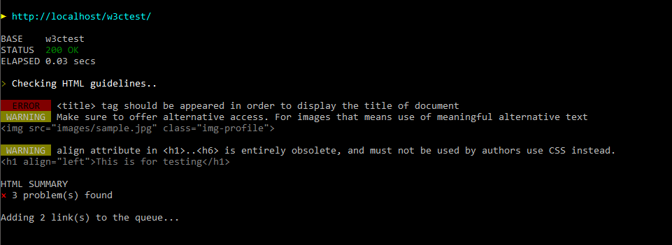
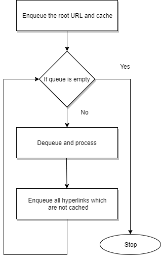

<div align="center">
    
</div>

[](https://gitter.im/w3c-link-validator/Lobby?utm_source=badge&utm_medium=badge&utm_campaign=pr-badge&utm_content=badge)
[](https://raw.githubusercontent.com/99xt/w3c-link-validator/master/LICENSE)
[](https://travis-ci.org/shalithasuranga/w3c-link-validator)
[](https://coveralls.io/github/shalithasuranga/w3c-link-validator?branch=master)

Very good command line tool for W3C validation and broken link detection of your local development or production URL.
Validation errors,warnings or suggestions will be reported to terminal.


## Installation


Install with the terminal.

```bash
$ npm install w3c-link-validator -g
```

After installation `w3clink` command will be available globally.

_Note :  'w3c-link-validator' is not in the npm registry yet. Therefore kindly follow [developers installation](#contributing)._


## Tutorial

#### Get started

See the command line help first.

```bash
$ w3clink --help
```


```bash

  Usage: w3clink [options]


  Options:

    -V, --version                                            output the version number
    check, --check <url> [verbose] [onlyhtml] [suggestions]  Validate links and html both
    -h, --help                                               output usage information

```

#### Validation command


```bash
$ w3clink check <url> [options]
```


This command will start validation service for specific URL. URLs per each page will be tested recursively.

**Options**

- `verbose` will show you anything during the validation. Eg hyperlinks per page.
- `onlyhtml` will block the deep url traversing. Use if you want to validate html standards only. 
- `suggestions` will log the suggestions also.

Example 

```bash
$ w3clink check http://localhost/w3ctest/ suggestions
```

Sample output on Windows terminal



Massive websites may log bunch of messages to your terminal. Therefore you may save your log to a file.

```bash
 $ w3clink check http://localhost/w3ctest/ suggestions > mylogfile.txt
```


## Contributing

#### Development setup

Fork and clone repo 

```bash
$ git clone https://github.com/<username>/w3c-link-validator.git
```

Install dependencies

```bash
$ npm install
```

Link to global commands

```bash
$ npm link
```

Run the tests

```bash
$ npm run test
```

Check the code coverage with [istanbul](https://istanbul.js.org/). HTML report will be generated to `/coverage/lcov-report`

```bash
$ npm run coverage
```


#### Crawling algorithm





#### Your contribution

We expect your contribution to improve this project. You may..

- Open [issues](https://guides.github.com/features/issues/) for bug reporting or new feature suggestions.
- Submit [pull requests](https://help.github.com/articles/about-pull-requests/) from your fork in order to close existing issues.

We encourage you to apply Github best practices for the communication and development through the repo.

Happy contributing! 

## Acknowledgement

w3c-link-validator is initially developed for the [Hacktitude](http://opensource.99xtechnology.com/hacktitude/) open source hackathon. Special thanks goes to project mentors [@thinkholic](https://github.com/thinkholic), [@lakindu95](https://github.com/lakindu95), [@rehrumesh](https://github.com/rehrumesh) and awesome [Dotitude Family](http://dotitude.com/) from [99xt](http://99xtechnology.com/).

## License

MIT © [99XT](https://github.com/99xt)


